### Заметки на тему карты и svg к заданию Online-zoo
  То, что я понял и нашел в процессе изучения предмета.
   <a href="https://pastebin.com/c2MnhNEj" target="_blank">Моё SVG с картой</a> 
В общем такой принцип:
1. Находим нужный нам элемент в фигме
2. Переименовываем его и его дочерние элементы как нам удобно в левом столбце (см скриншот 1), чтобы потом легче было с ним возиться.
   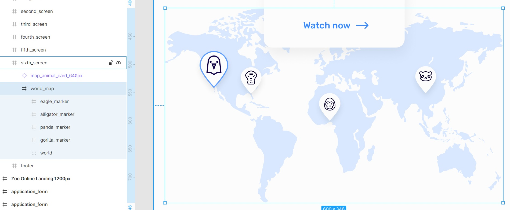
3. У интересующих нас элементов не должно быть дополнительных эффектов в духе свечения или теней, по этому находим такие эффекты и отключаем их перед экспортом
  Находим:
   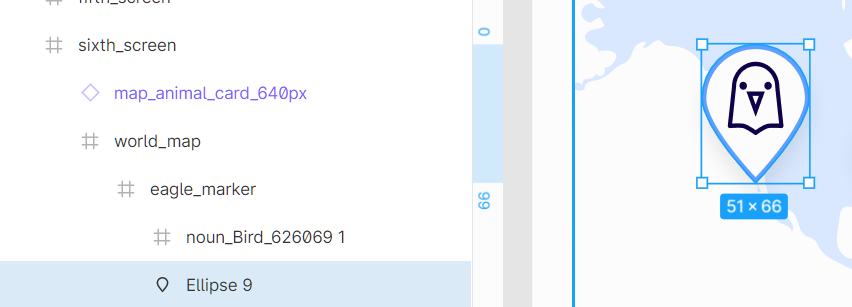 
  Отключаем тень в правом столбце:
   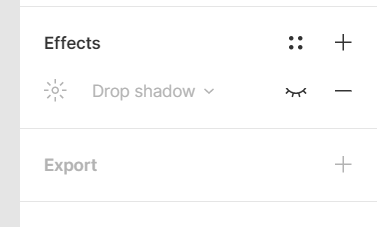 
4. Выбираем в левом столбце элемент родитель, в данном случае # world_map
и добавляем ему Export в правом столбике (выбираем формат SVG и тыкаем на три точки справа - ставим галочку на include "id")
   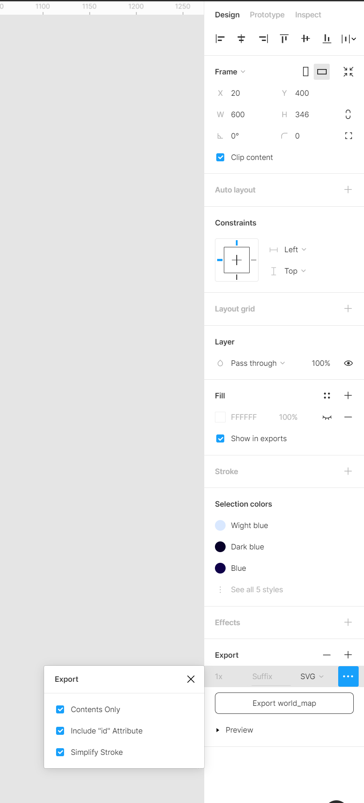
5. Жмякаем на кнопочку в том же Export
   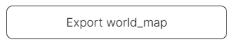
7. Получили SVG который теперь нужно привести в презентабельный рабочий вид.
   Его можно открыть любым текстовым редактором, я открываю той же Visual Studio Code и вижу вот такую пугающую картину:
   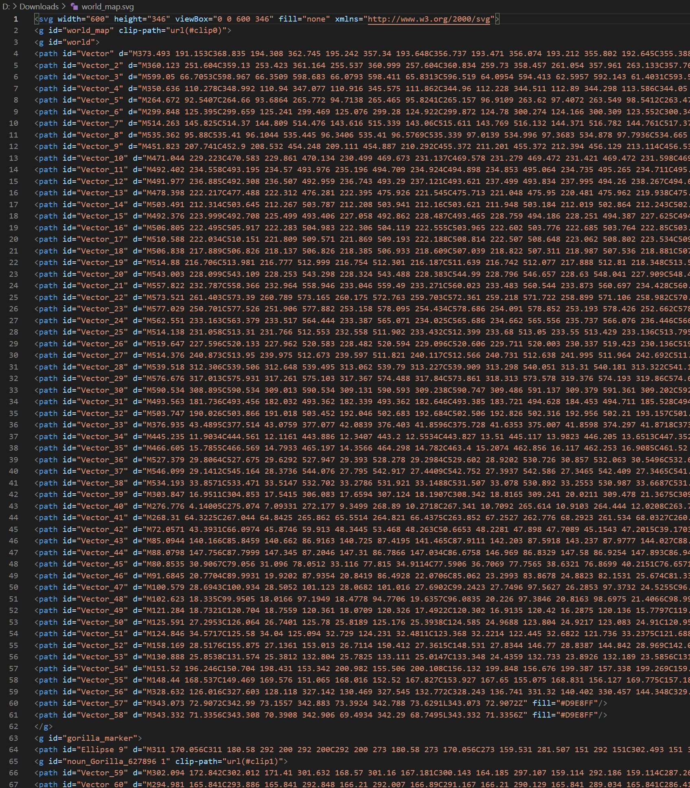
7. Дальше мы приводим все к красивому рабочему виду. Там где нам не нужны id (у не уникальных элементов векторных, к примеру) можем смело их стирать
 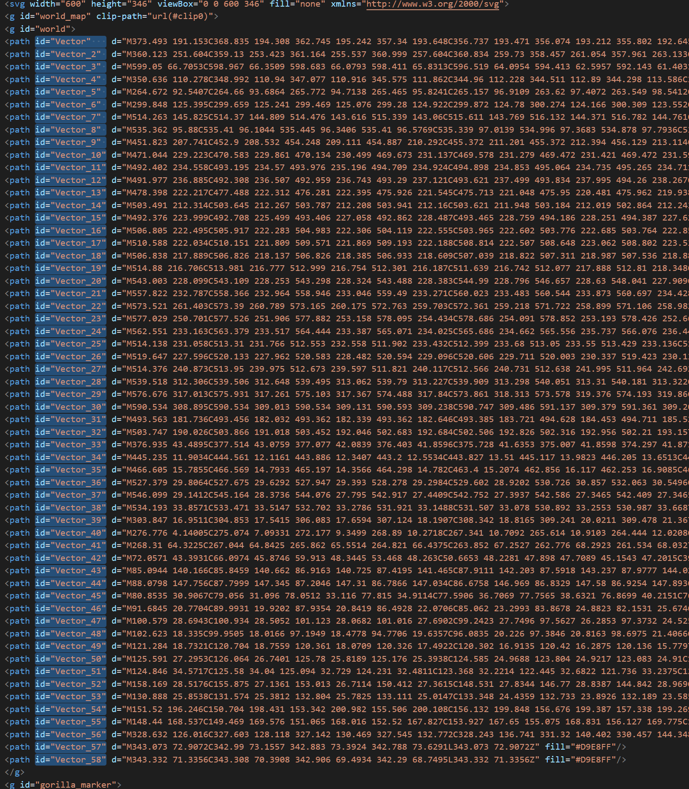 добавляем отступы:
 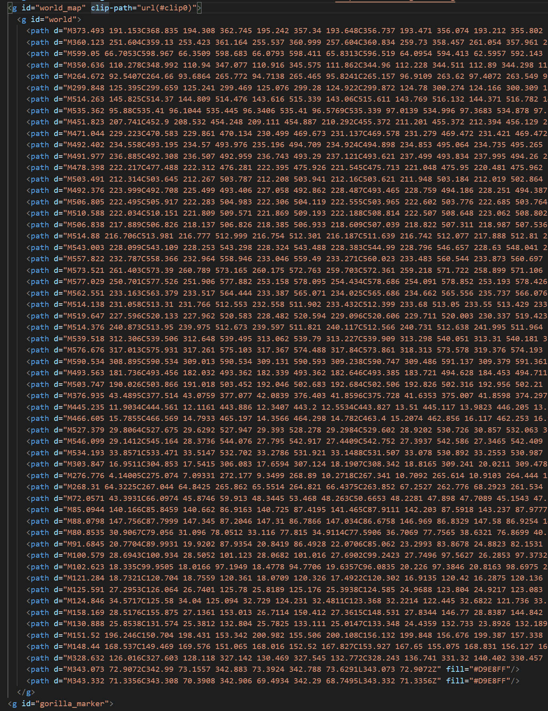 
и после этого уже не так страшно работать с этим, можно сворачивать строки по группам:
 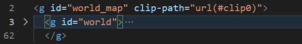
8. Дальше в CSS можно будет к ним обращаться через родителя, как в моем случае я при наведении на векторную группу пина отдельно регулирую заливку основы и включаю отображение обводки:
<pre><code>.full-map__pin__body,
.full-map__pin__icon {
  cursor: pointer;
}
.full-map__pin:hover > .full-map__pin__body {
  fill: #fff;
}
.full-map__pin:hover > .full-map__pin__outline {
  stroke-opacity: 1;
}</code></pre>

Пример того как у меня выглядит код карты вставленный в HTML:
 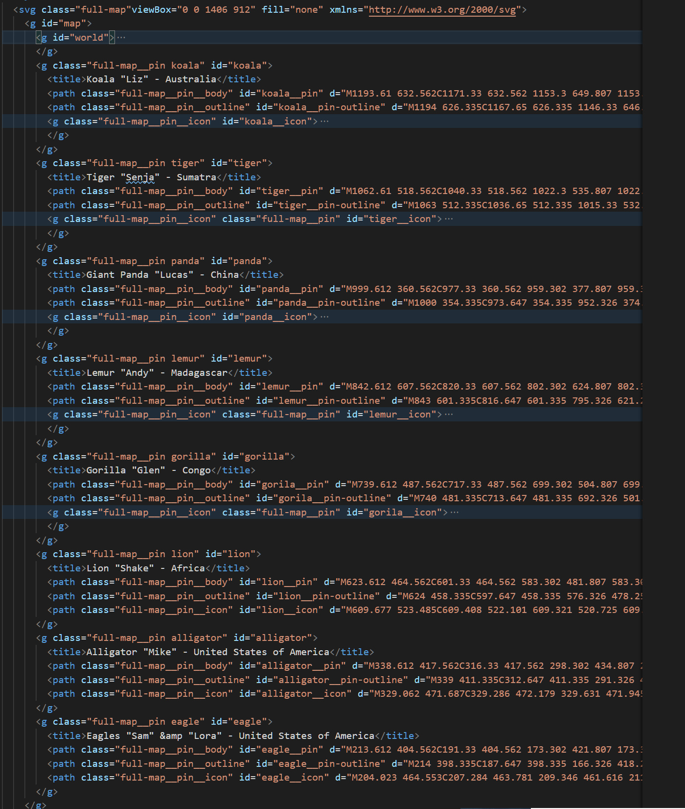 
и вот так выглядит CSS для нее:
 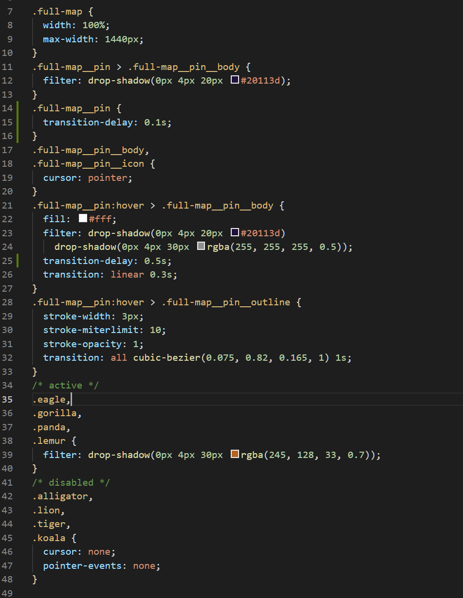 
-И к третьему пункту про отключение drop-shadow стиля в фигме меня спрашивали зачем:
 Мне так удобнее в дальнейшем работать с объектами, свечение можно прописать в css, а работать с svg-шным фильтром очень геморройно и я не знаю как :upside_down:  и занимает еще больше места в html документе.
-Еще момент с пинами для нашего второго варианта - я их экспортировал с видимой обвокой и потом вписывал им вручную stroke-opacity="0" в самом svg, можно тоже самое и через CSS сделать, но мне показалось удобнее вписать этот параметр в сам svg.
-Еще от элемента обводки full-map__pin__outline можно целиком избавиться и прописать его в стилях:
<pre><code>.full-map__pin > .full-map__pin__body {
  stroke: #fff;
  stroke-width:6;
  stroke-miterlimit: 10;
}</code></pre>
По сути просто берем все те же параметры, что есть в моем варианте экспорта карты у элемента full-map__pin__outline и передаем их через CSS уже самому элементу пина, который у меня называется .full-map__pin__body
в svg они указаны в конце <path> :
<pre><code>
path id="koala__pin-outline" d=". . ." stroke="white" stroke-opacity="0" stroke-width="6" stroke-miterlimit="10" stroke-linejoin="round"/
</code></pre>
-Для чего я так поступил? Фигма при экспорте 100% прозрачных вектором просто не экспортирует их - игнорирует.
-От id в svg можно тоже избавиться, если ими не пользуетесь в стилях, они были мне нужны для удоства работы с самим svg при экспорте, чтобы понять где-что.
-Если делаете отдельно пины, отдельно карта, то позиции объектов относительно контейнера можно посмотреть в фигме:
   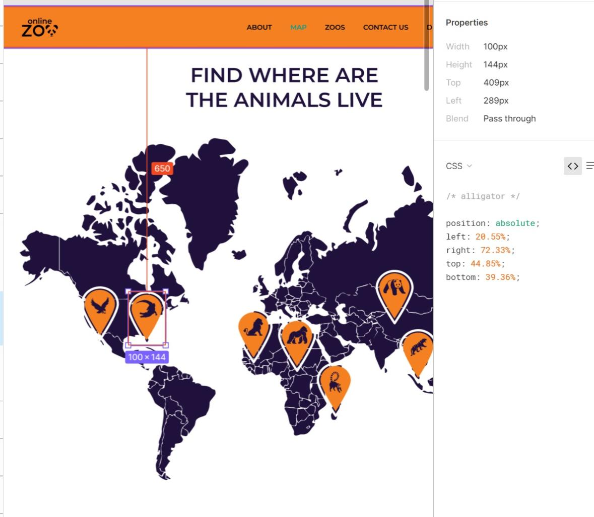 
  <pre><code>.alligator{
  position: absolute;
  left: 20.55%;
  right: 72.33%;
  top: 44.85%;
  bottom: 39.36%;
}</pre></code>

 Как-то так. Устал пересылать соблюдая последовательность изображений по этому теперь в таком формате. 
Если оказалось полезно - можете сказать спасибо в RSApp - там в футере увидите кнопочку в разделе Feedback - <https://app.rs.school/gratitude> ; через дискорд спасибо не идет в статистику.
 @sergeybocharov-test
